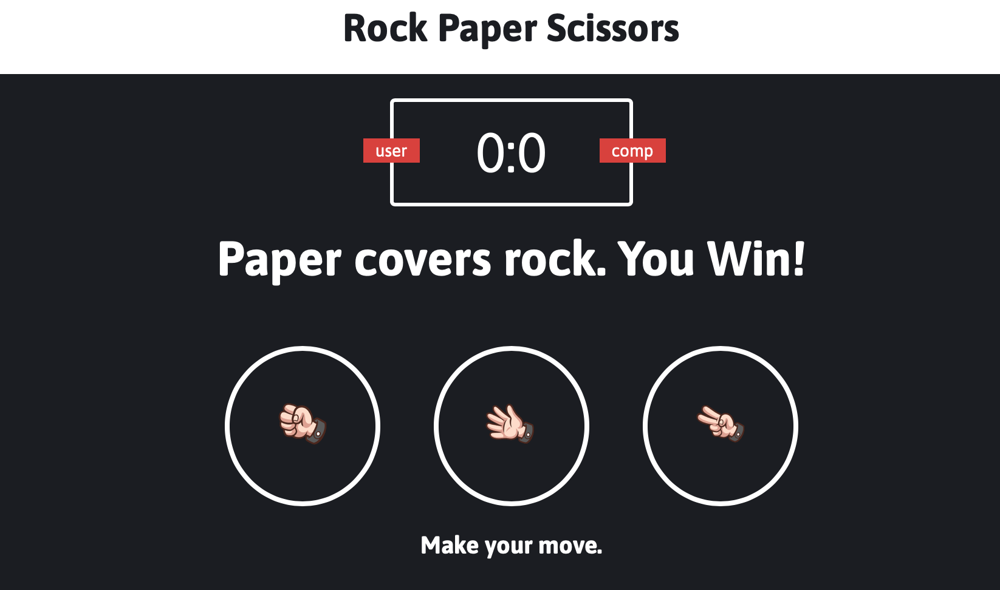

#  rock-paper-scissors
This is a simple "Rock, Paper, Scissors" game built with HTML, CSS, and JavaScript. The game allows users to play against the computer, where the user selects one of the three options (Rock, Paper, or Scissors), and the computer makes a random selection. The game shows the result of each round and keeps track of the score.

## 🚀 Technologies Used
- **HTML** - Structure and layout of the page.
- **CSS** - Styling and design of the game.
- **JavaScript** - Game logic and interactivity.

## 🎨 Screenshot


## 🔗 Live Demo
➡ [View the Project] https://cxcxkx.github.io/rock-paper-scissors/

## 📂 Installation
1. **Clone the repository:**
   ```bash
   git clone https://github.com/cxcxkx/rock-paper-scissors.git
   
